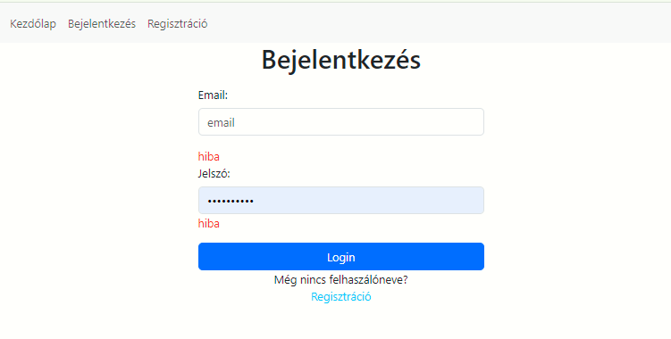
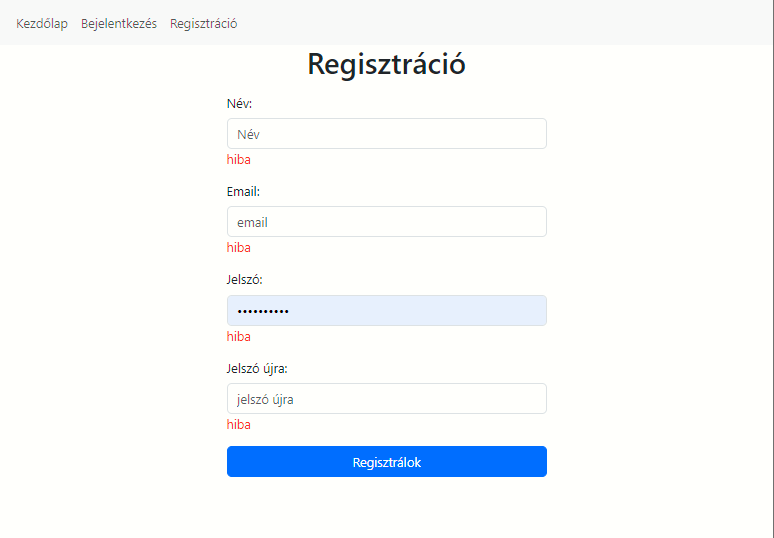
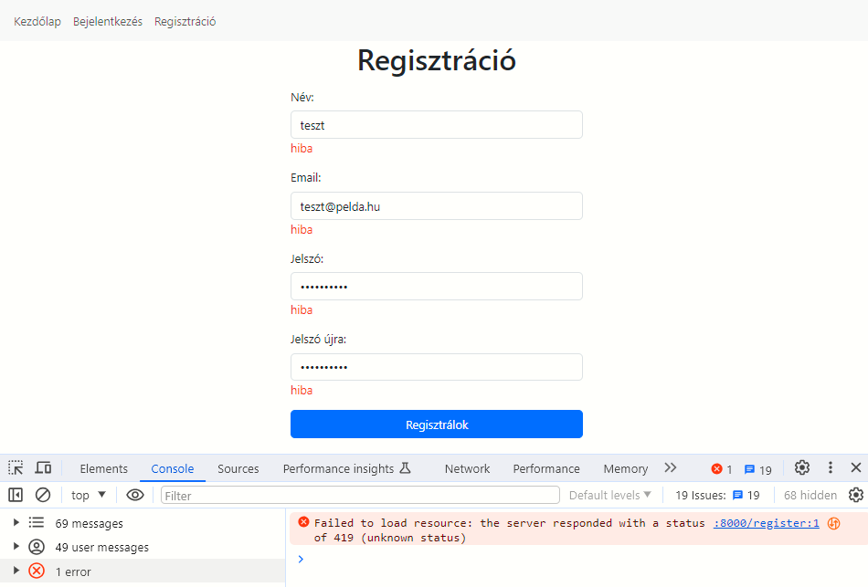
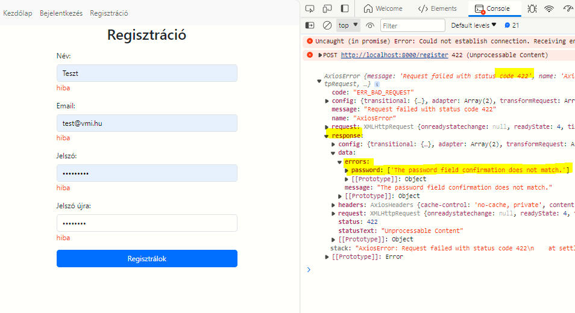

# Laravel11 api és autentikáció, React login

**A Laravel autentikációhoz a Breeze csomagot fogjuk használni, amely a Sanctumot alkalmazza az API token-alapú autentikációhoz, és a CSRF tokent a kérések biztonságos kezelésére.**

Egy RESTful alkalmazás esetén a backend számára fontos ellenőrizni, hogy a végpontjaira érkezett kérések kiszolgálhatók-e, vagyis van-e jogosultsága a kérő félnek az adott végpont eléréséhez.
Például nem biztos, hogy bárki számára elérhetővé szeretnénk tenni az alkalmazottaink listáját. Ezért a kívülről érkező kéréseket azonosítanunk kell.

## CSRF token alapú azonosítás

A CSRF token (Cross-Site Request Forgery token) egy védekezési mechanizmus, amely megakadályozza a jogosulatlan műveletek végrehajtását egy webalkalmazásban. Ez különösen fontos, ha a frontend és a backend külön hoston fut, mivel a böngésző automatikusan továbbítja a hitelesítési sütiket az azonos domainhez, ami támadási felületet teremthet.

A CSRF token egyedi, véletlenszerűen generált karakterlánc, amelyet a backend azonosít minden hiteles kérésnél. Ez a token a következőképpen védi az alkalmazást:

1. **Token generálása**: A backend minden felhasználói munkamenethez generál egy CSRF tokent, amelyet a frontendnek továbbít (általában egy sütiben vagy az API válaszában).
2. **Token használata**: A frontend minden állapotváltoztató (pl. POST, PUT, DELETE) kérésben elküldi a CSRF tokent a backend számára, tipikusan a kérés fejlécében vagy a kéréssel együtt.
3. **Token ellenőrzése**: A backend ellenőrzi, hogy a kapott token egyezik-e a felhasználói munkamenethez tartozóan tárolt tokennel. Ha nem egyezik, a kérés elutasításra kerül.

A CSRF token egy további biztonsági réteg, amely garantálja, hogy a kérés a frontend alkalmazásból érkezik, nem pedig egy külső támadótól.
A backend minden POST, PUT, DELETE vagy más műveletnél ellenőrizze a CSRF tokent.
 A frontend oldalon ügyelni kell arra, hogy a CSRF tokent ne lehessen könnyen megszerezni. 

# Laravel telepítése és beállításai
<a href="https://www.youtube.com/watch?v=LmMJB3STuU4&list=PL38wFHH4qYZUXLba1gx1l5r_qqMoVZmKM">Videó alapján</a>

<a href="https://laravel.com/docs/11.x/installation">Telepítési útmutató</a>

    laravel new example-app

A telepítés során válaszd a breeze-t és az api végpontokat. 

### .ENV fájl

Az env fájlban az alábbi változtatások kellenek.

    DB_CONNECTION=mysql
    DB_HOST=127.0.0.1
    DB_PORT=3306
    DB_DATABASE=laravel_react_api
    DB_USERNAME=root
    DB_PASSWORD=

    APP_URL=http://localhost
    FRONTEND_URL=http://localhost:3000
    SANCTUM_STATEFUL_DOMAINS=localhost:3000

A SESSION_DRIVER értékét állítsuk át cookie-ra, hogy a fontend oldali kiszolgálónk tudja kezelni a csrf tokent
Valamint a SESSION_DOMAIN értékét localhostra kell állítani

    SESSION_DRIVER=cookie #database helyett
    SESSION_DOMAIN=localhost

 Szintén a telepítés során a kérdésekre adott válaszokkal konfigurálható és az adatbázis rögtön migrálható is.
 Ne felejtsd el az api key-t generálni, ha nem tette volna meg a telepítő automatikusan!

    php artisan key:generate

## Néhány szó a  SESSION_DRIVER konfigurációs beállításról

A Laravel alkalmazásban a SESSION_DRIVER konfigurációs beállítás azt határozza meg, hogy a munkamenet (session) adatokat milyen tárolási módszerrel kezelje az alkalmazás. 

1. **SESSION_DRIVER=database**

- **Tárolási hely**: Az adatbázisban tárolja a munkamenet adatokat.
- **Használat**: Ez a módszer ideális, ha több szervert használsz (pl. load balancing esetén), és azt szeretnéd, hogy minden szerver ugyanazokat a munkamenet adatokat érje el. Az adatbázis biztosítja, hogy a munkamenetek megosztottak legyenek.
Követelmény: Egy munkamenetek számára létrehozott tábla szükséges az adatbázisban. A php artisan session:table parancs létrehozza ezt a táblát, majd a php artisan migrate alkalmazza.
- **Előnyök**:
    Jobb skálázhatóság több szerver esetén.
    Biztonságosabb lehet, mivel az adatbázis hozzáférése jobban kontrollálható.
- **Hátrányok**: Lassabb lehet, mint a cookie alapú módszer, mivel minden munkamenet-ellenőrzéshez adatbázis-lekérdezés szükséges.

2. **SESSION_DRIVER=cookie**

- **Tárolási hely**:  A kliens (felhasználó) böngészőjében, cookie formájában tárolja a munkamenet adatokat.
- **Használat**: Ez a módszer egyszerűbb és kevésbé erőforrásigényes, mivel nem használja az adatbázist.
- **Előnyök**
    Gyorsabb, mivel nem kell adatbázis-lekérdezéseket végezni.
    Nem kell külön adatbázis-tábla a munkamenetekhez.
    Skálázható, mert a munkamenet adatokat a kliens gépe hordozza.
- **Hátrányok**:
    A munkamenet adatok mérete korlátozott (a cookie méretkorlátja miatt).
    Nem alkalmas érzékeny adatok tárolására, hacsak nem titkosítod megfelelően.
    Ha a felhasználó törli a cookie-kat, elvesznek az adatok.

## Felhasználó létrehozása és migrálása az adatbázisba: 

    php artisan migrate:fresh --seed

# React telepítése

Az alábbi <a href="https://www.youtube.com/watch?v=LPaSteXj0MQ&list=PL6tf8fRbavl2Y9nntlYBVS64bk28ffekB&index=2">videó</a> vite-tel telepíti, de a lényeg ugyanaz. 

    npx create-react-app react_frontend

## Alapcsomagok telepítése

1. <a href="https://react-bootstrap.netlify.app/docs/getting-started/introduction">react bootstrap</a>
        npm install react-bootstrap bootstrap

    Ne felejstd el az index.js-be importálni:

        import 'bootstrap/dist/css/bootstrap.min.css';

2. <a href="https://www.npmjs.com/package/axios">axios</a>
        npm install axios

3. <a href="https://reactrouter.com/home">react router </a>
        npm install react-router

**Ne feledd, hogy a frontend és a backend alkalmazást külön VS Code ablakban indítsd el!**

### Mappastruktúra kialakítása

-   pages: itt fogjuk tárolni az egyes oldalakat
-   layouts: itt fogjuk tárolni a különböző jogosultságokhoz tartozó menüket, elrendezéseket.
-   components: itt fogjuk tárolni az oldalakat felépítő komponenseket
-   api: itt fogjuk tárolni az axios beállításait
-   contexts: itt fogjuk tárolni a contextusokat, providereket.

### Route és a navigáció

#### Oldalak létrehozása

A **pages** mappában hozzuk létre az alábbi oldalakat egy alap function komponens segítségével

-   Kezdolap
-   Bejelentkezes
-   Regisztracio

#### App.js fájlban alakítsuk ki az útvonalakat

    import { Route, Routes } from "react-router-dom";
    import Kezdolap from "./pages/Kezdolap";
    import Bejelentkezes from "./pages/Bejelentkezes";
    import Regisztracio from "./pages/Regisztracio";
    import VendegLayout from "./layouts/VendegLayout";

    function App() {
        return (
            <Routes>
                <Route path="/" element={<VendegLayout />}>
                    <Route index element={<Kezdolap />} />
                    <Route path="bejelentkezes" element={<Bejelentkezes />} />
                    <Route path="regisztracio" element={<Regisztracio />} />

                </Route>
            </Routes>
        );
    }

    export default App;

#### Menü kialakítása a Navigacio komponensben

    import React from "react";
    import { Link } from "react-router-dom";

    export default function Navigacio() {
        return (
            <nav className="navbar navbar-expand-sm bg-light">
                

                    <ul className="navbar-nav">
                        <li className="navbar-item">
                            <Link className="nav-link" to="/">
                                Kezdőlap
                            </Link>
                        </li>
                        <li className="navbar-item">
                            <Link className="nav-link" to="/bejelentkezes">
                                Bejelentkezés
                            </Link>
                        </li>
                        <li className="navbar-item">
                            <Link className="nav-link" to="/regisztracio">
                                Regisztráció
                            </Link>
                        </li>
                    </ul>
                

            </nav>
        );
    }

#### Layout kialakítása - VendegLayout létrehozása a layouts mappában

    import React from "react";
    import Navigacio from "../pages/Navigacio";
    import { Outlet } from "react-router-dom";

    export default function VendegLayout() {
        return (
            <>
                <Navigacio />
                <Outlet />
            </>
        );
    }

#### Az App.js-ben állítsuk be a Layoutot a menüpontokhoz.

    import { Route, Routes } from "react-router-dom";
    import Kezdolap from "./pages/Kezdolap";
    import Bejelentkezes from "./pages/Bejelentkezes";
    import Regisztracio from "./pages/Regisztracio";
    import VendegLayout from "./layouts/VendegLayout";

    function App() {
        return (
            <Routes>
                <Route path="/" element={<VendegLayout />}>
                    <Route index element={<Kezdolap />} />
                    <Route path="bejelentkezes" element={<Bejelentkezes />} />
                    <Route path="regisztracio" element={<Regisztracio />} />

                </Route>
            </Routes>
        );
    }

    export default App;

## Bejelentkezés és Regisztrációs formok létrehozása

### Bejelentkezés form

A Bejelentkezés oldalon hozzunk létre az alábbi mintának megfelelő formot.
Minden beviteli mező alatt van egy div, ahova az esetleges hibaüzeneteket jelenítjük meg.

A Regisztráció feliratra kattintva navigáljunk a regisztráció oldalra.

    import React from "react";
    import { Link } from "react-router-dom";

    export default function Bejelentkezes() {
        return (
            

                <h1 className="text-center">Bejelentkezés</h1>
                <form>
                    

                        <label htmlFor="email" className="form-label">
                            Email:
                        </label>
                        <input
                            type="email"
                            className="form-control"
                            id="email"
                            placeholder="email"
                            name="email"
                        />
                    

                    

                        hiba
                    

                    

                        <label htmlFor="pwd" className="form-label">
                            Jelszó:
                        </label>
                        <input
                            type="password"
                            className="form-control"
                            id="pwd"
                            placeholder="jelszó"
                            name="pwd"
                        />
                        

                            hiba
                        

                    

                    

                        <button type="submit" className="btn btn-primary w-100">
                            Login
                        </button>

                        

                            Még nincs felhaszálóneve?
                            <Link className="nav-link text-info" to="/regisztracio">
                                Regisztráció
                            </Link>
                        

                    

                </form>
            

        );
    }

### Regisztrációs form

Hasonló módon hozzuk létre a regisztráció oldal formját is.

## Regisztráció és a Bejelentkezés logikája

Űrlapok beviteli mezőinek kezelése state-kkel történik, ezért a Bejelentkezés komponensben hozzunk létre az email és a password mezőkhöz state-t.
Ne felejtsük el importálni az useState react hook-ot!

### Bejelentkezés

    const [email, setEmail] = useState("");
    const [password, setPassword] = useState("");

Majd az input mezőkhöz helyezzük el a value tulajdonsághoz a megfelelő state értékét,
valamint a beviteli mező onChange eseményéhez a érték setterével állítsuk be a bevitt adatot.

pl. az email mező esetében most így alakul az input elem.

    <input
        type="email"

        // value beállítása a state értékére
        value={email}
        // state értékének módosításváltozik a beviteli mező tartalma
        onChange={(e) => {
            setEmail(e.target.value);
        }}

        className="form-control"
        id="email"
        placeholder="email"
        name="email"
    />

A form onSubmit eseményéhze pedig rendeljünk egy függvényt. Első lépésben szedjük le a submit gombról a hozzá rendelt alapértelmezett eseménykezelőt.

    function handleSubmit(e){
        e.preventDefault();
        //bejelentkezés kezelése
    }

### Regisztráció

Regisztráció esetén 4 state értékre van szükség

    const [name, setName] = useState("");
    const [email, setEmail] = useState("");
    const [password, setPassword] = useState("");
    const [password_confirmation, setPasswordConfirmation] = useState("");

### handleSubmit függvény - a bejelentkezési és regisztrációs adatok elküldése

Ebben a metódusban fogjuk elküldeni az adatokat a szerver felé axios segítségével asszinkron módon.

#### AXIOS alapértelmezett beállításai

Az api/axios.js fájlba írjuk az alábbi kódot:

-   importáljuk az Axios objektumot
-   létrehozunk egy új Axios példányt a create metódus segítsével.
-   megadjuk, hogy a kérések azonosítása cookie-k segítségével történik.

<code>
import axios from "axios";

//létrehozunk egy új Axios példányt a create metódus segítsével.
export const  myAxios=axios.create({
    // alap backend api kiszolgáló elérési útjának beállítása
    baseURL: "http://localhost:8000",
    
    //beállítjuk, hogy  a kérések azonosítása coockie-k segítségével történik.
    withCredentials: true,
});
</code>

#### Bejelentkezés logikája

A **Bejelentkezes** komponensbe importáljuk be az előbb létrehozott **saját** axios-unkat.

    import  axios  from "../api/axios";

Most már használhatjuk az axios post és get metódusait. Mivel ezek asszinkron hívások, ezért a handleSubmit függvényünket át kell alakítanuk asszinkron hívások kezelésére az alábbi módon.

-   Összegyűjtjük egyetlen objektumban az űrlap adatokat
-   Megpróbáljuk elküldeni a /login végpontra az adatot
-   Hiba esetén kiiratjuk a hibaüzenetet

    const handleSubmit = async (e) => {
        e.preventDefault();       
        const adat = {
            email: email,
            password: password,
        };       
        try {
            await axios.post("/login", adat );
        } catch (error) {
            console.log(error);
        }
    };

Hasonló módon kell eljárni a Regisztráció esetén is.

Ha most megpróbálunk regisztrálni a rendszerbe 419-es hibát kapunk.
Ennek oka, hogy nem azonosítottuk magunkat a szerver számára, ezért a szerver elutasította a kérésünket. A post kéréssel együtt el kell küldenünk a csrf tokent is, ami a kérésünk azonosítására szolgál.

A CSRF token felhasználónként egyedi kód, amit a weboldalak arra használnak, hogy a segítségével kivédjék az olyan támadásokat, amiknél illetéktelen felek egy felhasználó nevében küldenek a weboldalnak parancsokat (CSRF támadás).
Amikor egy felhasználó valamilyen kritikus funkciót próbál meg elérni egy weboldalon (például törlés vagy jelszóváltoztatás), akkor ahhoz ezt a korábban kapott tokent is el kell küldje a böngészője a szervernek. Mivel a token minden felhasználónál más és más, és nem lehet egyszerűen kitalálni, ezért a CSRF támadás tervezői nem tudják a parancsot a felhasználó nevében elküldeni, mert ahhoz a tokent is tudniuk kellene.

Ha "érvénytelen CSRF token", "CSRF token missing or incorrect", "CSRF token mismatch" vagy hasonló hibaüzenetet kapsz, az azt jelenti, hogy a böngésződ által küldött kód hibás. Ez előfordulhat például amiatt, hogy időközben egy másik ablakban kijelentkeztél az oldalról, vagy már nagyon rég nyitottad meg az oldalt, és a token azóta megváltozott vagy a cookie‑d lejárt.

#### CSRF azonosító token beépítése

Helyezzük el a Bejelentkezés és a Regisztráció komponensekben is a következő sorokat:
Ehhez a backenden készítsük el a token végpontot a web.php-ban.
A végpont visszaad egy sesson tokent. Ezt a tokent minden szerver felé intézett kéréskor el kell küldenünk a szervernek.

**Backend oldal web.php**:

    Route::get('/token', function () {
        return request()->session()->token();
    });

**Frontend oldal Bejelentkezés sé Regisztráció komponensekben**:

    let token = "";
    const csrf = () =>
        axios.get("/token").then((response) => {
            console.log(response);
            token = response.data;
        });

Majd az adatokkal együtt küldjük el a tokent is.

    const adat = {
        email: email,
        password: password,
        _token: token,
    };

Hasonlóan járunk el a regisztráció esetében is.

Ezzel lekérjük a backendtől az adott kéréshez tartozó CSRF toketn. Ezt a tokent kell visszaküldenünk a post kérésünkkel együtt ahhoz, hogy azonosítva legyünk, és a szerver tudja, hogy jogosan használjuk a végpontjait.

#### Navigáció készítése

Sikeres bejelentkezés vagy regisztráció esetén rögtön navigáljunk el a Kezdőlapra.

Ehhez használjuk a useNavigate Hook-ot.

-   Importáljuk az oldal tetején a useNavigate Hook-ot!
-   Majd hozzunk létre egy változót:

    const navigate = useNavigate();

-   Végül sikeres bejelentkezés után navigáljunk a kezdőlapra:

    navigate("/");

#### Hibakezelés

Amennyiben nem megfelelő adatokat adunk meg, az api kiszolgáló 422-es hibakóddal tér vissza, és kiolvashatjuk a válaszból a megfelelő mezőkhöz tartozó hibákat.

Ehhez szükségünk van egy új state-re a Bejelentkezés és a Regisztráció komponensekben.

    const [errors, setErrors] = useState("");

Az inputmezők mögötti div-eket cseréljük le ilyesmi kódra:

    

        {errors.email && (
            {errors.email[0]}
        )}
    

Módosítsuk a handleSubmit függvény catch ágát az alábbiak szerint: 

    } catch (e) {
        if (e.response.status === 422) {
            setErrors(e.response.data.errors);
        }
    }

**Most így néz ki a login kód**:

    import React, { useState } from "react";
    import { Link, useNavigate } from "react-router-dom";
    import axios from "../api/axios";

    export default function Bejelentkezes() {
        const navigate = useNavigate();
        const [email, setEmail] = useState("");
        const [password, setPassword] = useState("");
        const [errors, setErrors] = useState({
            name: "",
            email: "",
            password: "",
            password_confirmation: "",
        });

        
        let token = "";
        const csrf = () =>
            axios.get("/token").then((response) => {
                console.log(response);
                token = response.data;
            });
        console.log(csrf);

        const handleSubmit = async (e) => {
            e.preventDefault();
            //lekérjük a csrf tokent
            await csrf();
            //bejelentkezés
            //Összegyűjtjük egyetlen objektumban az űrlap adatokat
            const adat = {
                email: email,
                password: password,
                _token: token,
            };

            // Megrpóbáljuk elküldeni a /login végpontra az adatot
            // hiba esetén kiiratjuk a hibaüzenetet
            try {
                await axios.post("/login", adat );
                console.log("siker")
                //sikeres bejelentkezés esetén elmegyünk  a kezdőlapra
                navigate("/");
            } catch (error) {
                if (error.response.status === 422) {
                    setErrors(error.response.data.errors);
                }
            }
        };

        return (
            

                <h1 className="text-center">Bejelentkezés</h1>
                <form onSubmit={handleSubmit}>
                    

                        <label htmlFor="email" className="form-label">
                            Email:
                        </label>
                        <input
                            type="email"
                            // value beállítása a state értékére
                            value={email}
                            // state értékének módosítása ha változik a beviteli mező tartalma
                            onChange={(e) => {
                                setEmail(e.target.value);
                            }}
                            className="form-control"
                            id="email"
                            placeholder="email"
                            name="email"
                        />
                    

                    

                        {errors.email && (
                            {errors.email[0]}
                        )}
                    

                    

                        <label htmlFor="pwd" className="form-label">
                            Jelszó:
                        </label>
                        <input
                            type="password"
                            value={password}
                            onChange={(e) => {
                                setPassword(e.target.value);
                            }}
                            className="form-control"
                            id="pwd"
                            placeholder="jelszó"
                            name="pwd"
                        />
                        

                            {errors.password && (
                                
                                    {errors.password[0]}
                                
                            )}
                        

                    

                    

                        <button type="submit" className="btn btn-primary w-100">
                            Login
                        </button>

                        

                            Még nincs felhaszálóneve?
                            <Link className="nav-link text-info" to="/regisztracio">
                                Regisztráció
                            </Link>
                        

                    

                </form>
            

        );
    }

## AuthContext létrehozása

Context-ek használatával a programozási logikát kiemelhetjük a kompponensekből és egyetlen közös fájlban kezelhetjük.

-   Hozzuk létre a **contexts/AuthContext.js** fájlt.
-   Hozzuk létre benne az AuthContext objektumot.

    import { createContext} from "react";
    export const AuthContext = createContext({});

-   Hozzuk létre az alap Providert a context-hez.

    import { createContext } from "react";
    const AuthContext = createContext({});
    export const AuthProvider = ({ children }) => {
          return (
              <AuthContext.Provider
                  value={{ }}
              >
                  {children}
              </AuthContext.Provider>
          );
    };

Végül exportájuk a contextust. 

    export default function useAuthContext() {
        return useContext(AuthContext);
    }

-   Emeljük át a Bejelentkezés és a Regiszter komponensekből a közösen használadnó változókat és metódusokat.
-   axios import
-   csrf token lekérésére szolgáló függvény
-   handleSubmit logika - paraméterként fogja megkapni az elküldendő adatokat a komponenstől. (data)
-   az errort kezelő state

#### Bejelentkezett felhasználó adatainak lekérdezése

- Hozzunk létre a providerünkben egy user state-t. 

    const [user, setUser] = useState(null);

-Készítsük el a getUser metódust. Az /api/user végpontról tudjuk lekérni a bejelentkezett felhasználó adatait. A setUser függvénnyel beállítjuk a user váltzó értékét, miután a végpontról megérkezetta válasz. 

    //bejelentkezett felhasználó adatainak lekérdezése
    const getUser = async () => {
        const { data } = await axios.get("/api/user");
        setUser(data);
    };

#### Most így néz ki az AuthContext.js

    import { createContext, useContext, useState } from "react";
    import axios from "../api/axios";
    import { useNavigate } from "react-router-dom";
    const AuthContext = createContext();
    export const AuthProvider = ({ children }) => {
        const navigate = useNavigate();
        const [user, setUser] = useState(null);
        const [errors, setErrors] = useState({
            name: "",
            email: "",
            password: "",
            password_confirmation: "",
        });
        
        let token = "";
        const csrf = () =>
            axios.get("/token").then((response) => {
                console.log(response);
                token = response.data;
            });

        //bejelentkezett felhasználó adatainak lekérdezése
        const getUser = async () => {
            const { data } = await axios.get("/api/user");
            setUser(data);
        };
        
        
        const loginReg = async ({ ...adat }, vegpont) => {
            await csrf()
            console.log(token)
            adat._token = token;
            console.log(adat)
            //lekérjük a csrf tokent
            await csrf();
            //bejelentkezés
            //Összegyűjtjük egyetlen objektumban az űrlap adatokat

            // Megrpóbáljuk elküldeni a /login végpontra az adatot
            // hiba esetén kiiratjuk a hibaüzenetet
            try {
                await axios.post(vegpont, adat);
                console.log("siker");
                //sikeres bejelentkezés/regisztráció esetén
                //Lekérdezzük a usert
                await getUser();
                //elmegyünk  a kezdőlapra
                navigate("/");
            } catch (error) {
                console.log(error);
                if (error.response.status === 422) {
                    setErrors(error.response.data.errors);
                }
            }
        };

        return (
            <AuthContext.Provider
                value={{  loginReg, errors, getUser, user }}
            >
                {children}
            </AuthContext.Provider>
        );
    };
    export default function useAuthContext() {
        return useContext(AuthContext);
    }

## Contextus felhasználása

### Providerrel öleljük körbe az App komponenst az index-js fájlban
Fontos a useNAvigate hook használata szempontjából, hogy a BrowserRouter  ölelje körbe az AuthProvidert.

    <BrowserRouter>
        <AuthProvider>
            <App />
        </AuthProvider>
    </BrowserRouter>

Ne felejtsük el importálni az AuthProvidert

    import { AuthProvider } from "./contexts/AuthContext";

### Bejelentkezes és a Regisztracio komponensekben használjuk a contextust

Importáljuk AuthContext objektumot.

    import { AuthContext } from "../contexts/AuthContext";

A komponensen belül megadjuk a változókat.

    const { handleSubmit, errors } = AuthContext();

A Regisztráció  esetében hasonlóan járunk el.

Most így néz ki a bejelentkzés komponens eleje: 

    import React, { useState } from "react";
    import { Link } from "react-router-dom";
    import  useAuthContext  from "../contexts/AuthContext";

    export default function Bejelentkezes() {
        const [email, setEmail] = useState("");
        const [password, setPassword] = useState("");

        const { loginReg, errors } = useAuthContext();

        const handleSubmit = async (e) => {
            e.preventDefault();

            //bejelentkezés
            //Összegyűjtjük egyetlen objektumban az űrlap adatokat
            const adat = {
                email: email,
                password: password,
            };
            //*********** ITT HÍVJUK MEG useAuthContext-ből a loginReg függvényt. **************//
            loginReg(adat, "/login");
        };

        return (
            

           /************************ STB ***************************/

#### A Bejelentkezett felhasználó adatainak megjelenítése

A Kezdolap komponensben jelenítsük meg a bejelentkezett felhasználó nevét. 
Ehhez használjuk a useAuthContext() függvényünket. 

    import React, { useEffect } from "react";
    import useAuthContext from "../contexts/AuthContext";

    export default function Kezdolap() {
        const { user, getUser } = useAuthContext();
        useEffect(() => {
            console.log(user)
            if (!user) {
                getUser();
            }
        });
        return (
            

                <h1>Kezdőlap</h1>
                
Bejelentkezett felhasználó: {user?.name}

            

        );
    }

#### Kijelentkezés logikájának elkészítése

Az **AuthProviderben** létrehozunk egy függvényt, amely a kijelentkezés logikáját implementálja. 
A /logout végpont meghívásával kezdeményezni a kijelentkzést. 
Az azonosításhoz itt is le kell kérni a tokent a szerverről, és a kéréssel együtt elküldeni adatként.  

    const logout = async () => {
        await csrf()
        console.log(token)
        axios.post("/logout",{_token:token}).then((resp) => {
            setUser(null);
            console.log(resp);
        });
    };

Ne felejtsük el a Provider value értékei között felsorolni a logout függvényt is. 

#### Kijelentkezés menüpont készítése

Azt szeretnénk, hogy a még be nem jelentkezett felhasználó lássa a Bejelentkezés és a Regisztráció menüpontokat, de bejelentkzeés után ezekre a menüpontokra már nincs szükség, helyettük jelenjen meg a Kijelentkezés menüpont, amelyre akttintva meg kell hívnunk a Providerben definiált logout függvényt. 

Menjünk a **Navigacio** komponensbe.
- importáljuk a useAuthContext függvényünket. 
- importáljuk a user és a logout változókat a contextusunkból. 
- Módosítsuk a menünket! A Bejelentkezés és a Regisztráció menüpontok helyére most egy elágazás kell, attól függően, hogy van-e bejelentkzett felhasználó, vagy nincs.
Az alapszerkezet valahogy így fog kinézni: 

    {user ? <></> : <></>}

A két React.Fragment elem közé kell betennünk a kívánt menüpontokat. A végső kód: 

    import React from "react";
    import { Link } from "react-router-dom";
    import useAuthContext from "../contexts/AuthContext";

    export default function Navigacio() {
        const { user, logout } = useAuthContext();
        return (
            <nav className="navbar navbar-expand-sm bg-light">
                

                    <ul className="navbar-nav">
                        <li className="navbar-item">
                            <Link className="nav-link" to="/">
                                Kezdőlap
                            </Link>
                        </li>
                        {user ? (
                            <>
                                <li className="navbar-item">
                                    <button className="nav-link" onClick={logout}>
                                        Kijelentkezés
                                    </button>
                                </li>
                            </>
                        ) : (
                            <>
                                <li className="navbar-item">
                                    <Link className="nav-link" to="/bejelentkezes">
                                        Bejelentkezés
                                    </Link>
                                </li>
                                <li className="navbar-item">
                                    <Link className="nav-link" to="/regisztracio">
                                        Regisztráció
                                    </Link>
                                </li>
                            </>
                        )}
                    </ul>
                

            </nav>
        );
    }

